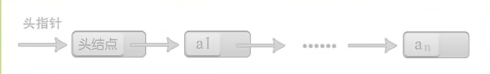
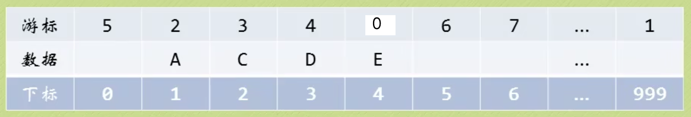
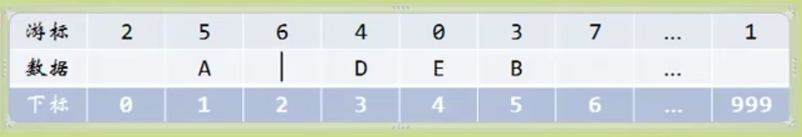
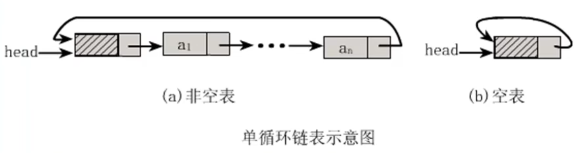
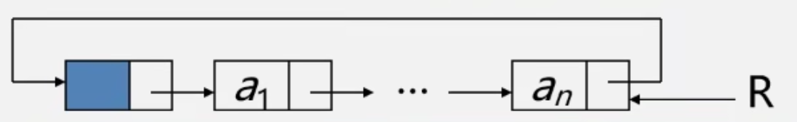
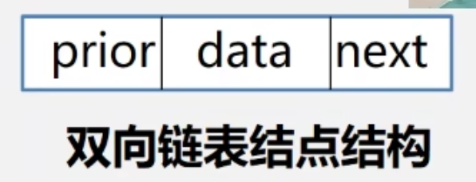
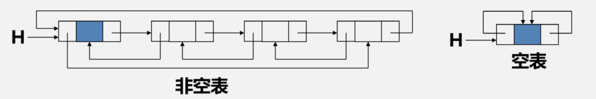
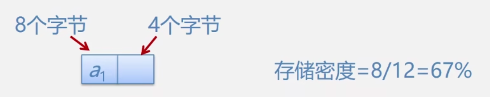

#### 线性表定义

- 线性表（List）：由零个或多个数据元素组成的有限序列。

- 这里需要强调几个关键的地方：
  - 首先它是一个序列，也就是说元素之间是有个先来后到的，像刚才的小蝌蚪就没有顺序。
  - 若元素存在多个，则第一个元素无前驱，而最后一个元素无后继，其他元素都**有且只有一个前驱和后继。**
  - 另外，线性表强调是有限的，事实上无论计算机发展到多强大，宅所处理的元素都是有限的。

#### 抽象数据类型

- 为了便于在之后的讲解中对抽象数据类型进行规范的描述，我们给出了描述抽象数据类型的标准格式：
  ADT 抽象数据类型名
  Data
  	数据元素之间逻辑关系的定义
  Operation
  	操作
  endADT

#### 线性表的抽象数据类型

- 我们给大家总结下线性表的抽象数据类型定义：

  ADT 线性表（List）

  Data

  ​	线性表的数据对象集合为｛al，a2，...，an｝，每个元素的类型均为DataType。其中，除第一个元素a1外，每一个元素有且只有	一个直接前驱元素，除了最后一个元素an外，每一个元素有且只有一个直接后继元素。数据元素之间的关系是一对一的关系。

  Operation

  ​	InitList（*L）：初始化操作，建立一个空的线性表L。

  ​	ListEmpty（L）：判断线性表是否为空表，若线性表为空，返回true，否则返回false。

  ​	ClearList（*L）：将线性表清空。

  ​	GetElem（L,i， *e）：将线性表L中的第i个位置元素值返回给e。

  ​	LocateElem（L, e）：在线性表L中查找与给定值e相等的元素，查找成功，返回该元素在表中序号; 否则，返回0表示失败。

  ​	ListInsert（*L,i,e）：在线性表L中第主个位置插入新元素e。

  ​	ListDelete（*L,i， *e）：删除线性表L中第i个位置元素，并用e返回其值。

  ​	ListLength（L）：返回线性表L的元素个数。

  endADT

#### 线性表顺序存储结构

- 线性表的顺序存储结构，在**存、读数据时**，不管是哪个位置，时间复杂度都是O(1)。而在**插入或删除**时，时间复杂度都是O(n)。

- 这就说明，它比较适合元素个数比较稳定，不经常插入和刪除元素，而更多的操作是存取数据的应用。

那我们接下来给大家简单总结下线性表的顺序存储结构的优缺点：

- 优点；
  - 无须为表示表中元素之间的逻辑关系而增加额外的存储空问。
  - 可以快速她存取表中任意位置的元素。

- 缺点：
  - 插入和刪除操作需要移动大量元素。
  - 当线性表长度变化较大时，难以确定存储空间的容量。
  - 容易造成存储空间的“碎片”(因为我们申请的空间都是大片连续的空间，这就造成两片空间之间的小空间被浪费掉)。

#### 线性表链式存储结构

`头指针与头结点异同`

那有童鞋就疑惑了，既然头结点的数据域不存储任何信息，那么头指针和头结点又有何异同呢？

头指针：

- 头指针是指链表指向第一个结点的指针，若链表有头结点，则是指向头结点的指针。
- 头指针具有标识作用，所以常用头指针冠以链表的名字（指针变量的名字）。
- 无论链表是否为空，头指针均不为空。
- 头指针是链表的必要先素。

头结点：

- 头结点是为了操作的统一和方便而设立的，放在第一个元素的结点之前，其数据域一般无意义（但也可以用来存放链表的长度）。
- 有了头结点，对在第一元素结点前插入结点和删除第一结点起操作与其它结点的操作就统一了。
- 头结点不一定是链表的必须要素。

单链表存储结构：

- 单链表图例：

  

- 空链表图例：

  

单链表读取：

- 说白了，就是从头开始找，直到第i个元素为止。
- 由于这个算法的时间复杂度取决于i的位置，当i=1时，则不需要遍历，而i=n时则遍历n-1次才可以。因此最坏情况的时间复杂度为O(n)
- 由于单链表的结构中没有定义表长，所以不能实现知道要循环多少次，因此也就**不方便使用for来控制循环。**
- 其核心思想叫做“工作指针后移”，这其实也是很多算法的常用技术。

单链表的插入：

单链表的删除：

效率：

- 我们最后的环节是效率PK，我们发现无论是单链表插入还是删除算法，宅们其实都是由两个部分组成：第一部分就是遍历查找第i个元素，第二部分就是实现插入和删除元素。
- 从整个算法来说，我们很容易可以推出它们的时间复杂度都是O(n)。
- 再详细点分析：如果在我们不知道第i个元素的指针位置，单链表数据结构在插入和刪除操作上，与线性表的顺序存储结构是没有太大优势的。
- 但如果，我们希望以第i个位置开始，插入连续10个元素，对于顺序存储结构意味着，每一次插入都需要移动n-i个位置，所以每次都是O(n)。
- 而单链表，我们只需要在第一次时，找到第i个位置的指针，此时为O(n)，接下来只是简单地通过赋值移动指针而已，时间复杂度都是O(1)。
- 显然，对于插入或刪除数据越频繁的操作，单链表的效率优势就越是明显啦~

#### 单链表的创建

头插法：**（插进去的结果与原来倒序）**

- 简单来说，就是把新加进的元素放在表头后的第一个位置：

  - 先让新节点的next指向头节点之后

  - 然后让表头的next指向新节点

尾插法：

#### 单链表结构与顺序存储结构的优缺点

我们分别以存储分配方式、时间性能、空间性能三方面来做对比。

存储分配方式：

- 顺序存储结构用一段连续的存储单元依次存储线性表的数据元素。
- 单链表采用链式存储结构，用一组任意的存储单元存放线性表的元素。

时间性能：

- 查找

  - 顺序存储结构O（1）

  - 单链表0（n）

- 插入和刪除

  - 顺序存储结构需要平均移动表长一半的元素，时间为0（n）

  - 单链表在计算出某位置的指针后，插入和刪除时间仅为0（1）

空间性能：

- 顺序存储结构需要预分配存储空间，分大了，容易造成空间浪费，分小了，容易发生溢出。

- 单链表不需要分配存储空间，只要有就可以分配，元素个数也不受限制。

**综上所述对比，我们得出一些经验性的结论：**

- 若线性表需要频繁查找，很少进行插入和刪除操作时，宜采用顺序存储结构。

- 若需要频繁插入和删除时，宜采用单链表结构。

#### 静态链表



- 线性表的静态链表存储结构

  ```c++
  #define MAXSIZE 1000
  typedef struct
  ｛
      ElemType data；// 数据
      int cur; // 游标（Cursor）
  } Component, StaticLinkList[MAXSIZE];
  ```

  

- 对静态链表进行初始化相当于初始化数组

  ```c++
  Status InitList(StaticLinklist space)
  {
    int i;
    for(i=0; i < MAXSIZE-1; i++ )
    space[i].cur = i + 1;
    space[MAXSIZE-1].cur = 0 ;
    return OK; 
  }
  ```

- 注意：
  - 我们对数组的第一个和最后一个元素做特殊处理，他们的data不存放数据。
  - **我们通常把未使用的数组元素称为备用链表（如上图游标6以及6之后的游标对应的位置就是备用链表）。**
  - 数组的第一个元素，即下标为0的那个元素的cur，就存放备用链表的第一个结点的下标。
  - 数组的最后一个元素，即下标为MAXSIZE-1的cur则存放第一个有数值的元素的下标，相当于单链表中的头结点作用。

- 静态链表的插入操作

  

- 静态链表的删除操作

  

#### 静态链表优缺点总结

优点：

- 在插入和刪除操作时，只需要修改游标，不需要移动元素，以而改进了在顺序存储结构中的插入和删除操作需要移动大量元素的缺点。

缺点：

- 没有解决连续存储分配（数组）带来的表长难以确定的问题。
- 失去了顺序存储结构随机存取的特性。

**总的来说**，**静态链表其实是为了给没有指针的编程语言设计的一种实现单链表功能的方法**。

尽管我们可以用单链表就不用静态链表了，但这样的思考方式是非常巧妙的，应该理解其思想，以备不时之需。

#### 单循环链表

**头指针表示：**



头指针表示单循环链表

- 找$a_1$的时间复杂度为O(1)，找$a_n$的时间复杂度为O(n)

注意：表的操作通常是在表的首尾位置进行的

**尾指针表示：**



尾指针表示单循环链表

- $a_1$的存储位置是R->next->next，$a_n$的存储位置是R，时间复杂度为O(1)

#### 双向链表

双向链表的结构定义：

```c++
typedef struct DuLNode{
  Elemtype data;
  struct DuLNode *prior, *next;
} DuLNode, *DuLinkList;
```




#### 双向循环链表

和单链的循环表类似，双向链表也可以有循环表

- 让头结点的前驱指针指向链表的最后一个结点
- 让最后一个结点的后继指针指向头结点。



**双向链表结构的对称性（设指针p 指向某一结点）**<br/>p ->prior -> next = p =p->next ->prior<br/>在双向链表中有些操作（如：ListLength,GetElem等），因仅涉及一个方向的指针，故它们的算法与线性链表的相同。但在插入、删除时，则需同时修改两个方向上的指针，两者的操作的时间复杂度均为O(n)。

**双向链表的插入：**

**双向链表的删除：**

**存储密度**：存储密度是指结点数据本身所占的存储量和整个结点结构中所占的存储量之比，即：

$\frac{节点数据本身占用的空间}{节点占用的空间总量}$



一般地，存储密度越大，存储空间的利用率就越高。显然，顺序表的存储密度为1（100%），而链表的存储密度小于1。