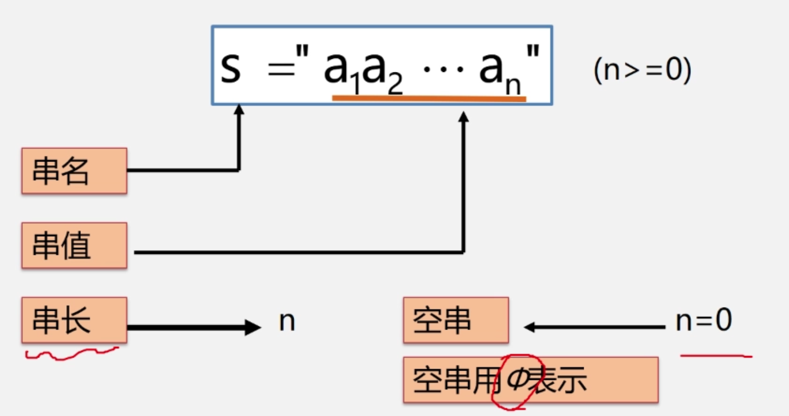
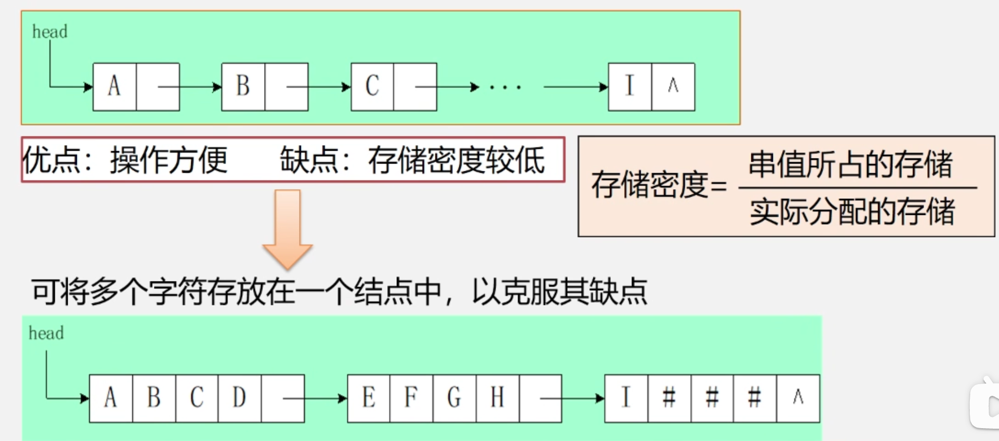
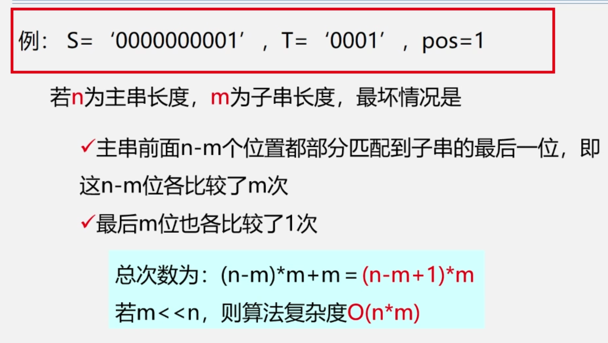
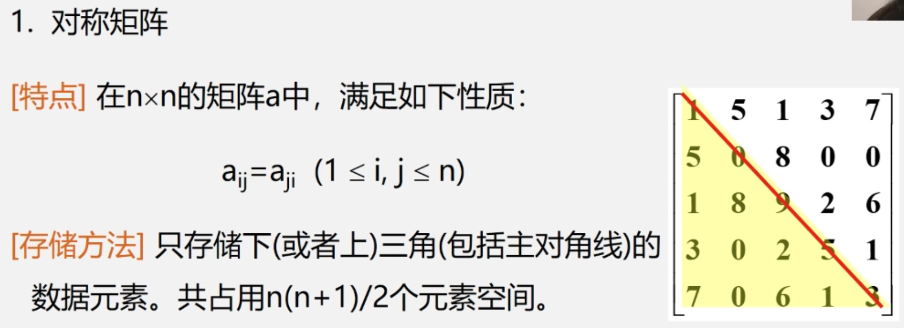
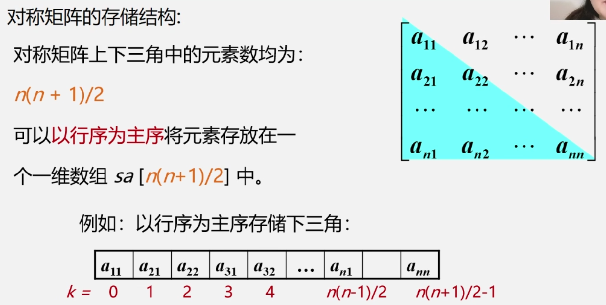
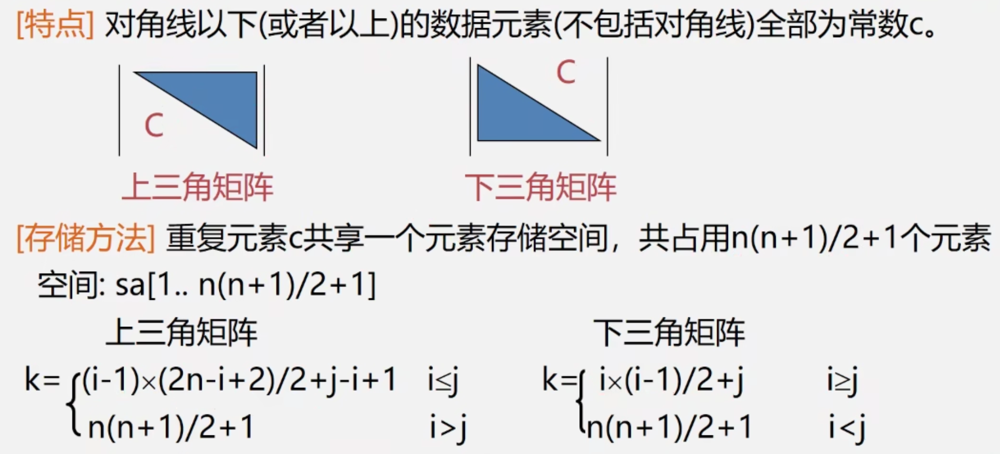
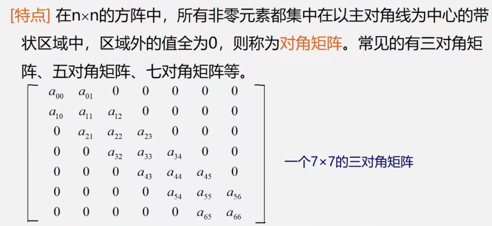
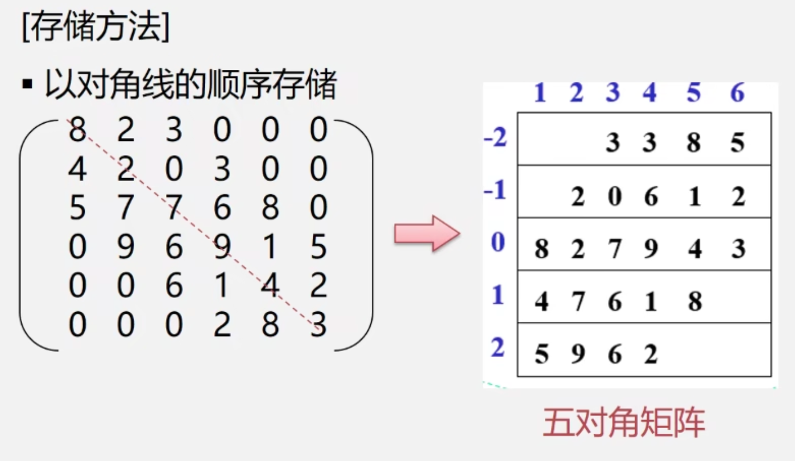

# 4.1 串

串(String)，是由零个或多个字符组成的有限序列



串的几个术语

- 子串：一个串中任意个连续字符组成的子序列（含空串）称方该串的子串。

  例如，*"abcde"*的子串有：

  *""、"a"、"ab"、"abc"、"abcd"* 和 *"abcde"*等

  **真子串**是指不包含自身的所有子串。

- 主串：包含子串的串相应的称为主串
- 字符位置：字符在序列中的序号为该字符在串中的位置
- 子串位置：子串**第一个字符**在主串中的位置
- 空格串：由一个或多个空格组成的串，与空串不同

- 串相等：当且仅当两个串长度相等并且对应位置字符相同
- 所有空串都相等

# 4.2 案例引入

# 4.3 串的类型定义、存储结构以及运算

## 4.3.1 串的抽象数据类型定义

ADT String{

数据对象：

数据关系：

基本操作：

}ADT String

## 4.3.2 存储结构

- **串的顺序存储结构(用的多！！)**

  ```c++
  #define MAXLEN 255
  typedef struct
  {
    char ch[MAXLEN+1]; // 存储串的一维数组，一般将串存放在1-MAXLEN+1的位置，方便研究
    int length; // 串当前长度
  }SString;
  ```

- 串的链式存储结构------块链结构

​		


```c++
#define CHUNKSIZE 80
typedef struct Chunk
{
  char ch[CHUNKSIZE];//块的大小可由用户定义
  struct Chunk *next;
}Chunk;
typedef struct
{
	Chunk *head, *tail;//串的头指针和尾指针
  int curlen;//串的当前长度
}LString;//字符串的块链结构
```

## 4.3.3 串的模式匹配算法

算法目的：

- 确定主串中所含**子串（模式串）**第一次出现的位置（定位）

算法应用：

- 搜索引擎、拼写检查、语言翻译、数据压缩

算法种类：

- BF算法（Brute-Force，又称古典的、经典的、朴素的、穷举的）
- KMP算法（特点：速度快）

**串的模式匹配算法---BF算法，亦称简单匹配算法。采用穷举法的思路**



**串的模式匹配算法---KMP算法**

# 4.4 数组

按照一定格式排列起来的，具有相同类型的数据元素集合

一维数组：若线性表中的数据元素为非结构的简单元素，则称为一维数组。

一维数组的逻辑结构：线性结构。定长的线性表。

声明格式： 数据类型 变量名称 [长度]；

例：int num[5] =｛0,1,2,3,4｝

二维数组：若一维数组中的数据元素又是一维数组结构，则称为二维数组。

二维数组的逻辑结构

- 非线性结构：每一个数据元素既在一个行表中，又在一个列表中。

- 线性结构：该线性表的每个数据元素也是一定长的线性表。
- 声明格式： 数据类型 变量名称 \[行数][列数]；

- int num\[2][3]

## 4.4.1 数组的抽象数据类型定义

基本操作：

1. InitArray (&A,n,bound1, ...boundn)
2. DestroyArray (&A)
3. Value(A,&e,index1,..., indexn)
4. Assign (A,&e,index1,..., indexn)

## 4.4.2 数组的顺序存储

二维数组：

- 两种顺序存储方式
  - 以行序为主序
  - 以列序为主序

## 4.4.3 特殊矩阵的压缩存储

1.什么是压缩存储？


若多个数据元素的值都相同，则只分配一个元素值的存储空间，且零元素不占存储空间。

2. 什么样的矩阵能够压缩？

一些特殊矩阵，如：对称矩阵，对角矩阵，三角矩阵，稀疏矩阵等。

3.什么叫稀疏矩阵？

矩阵中非零元素的个数较少（一般小于5%）

**对称矩阵**





其中任意一个元素的位置计算方式如下：

- 例如  $a_{n1}$
  - 首先看他前面有多少个元素：前面有$n-1$行，所以一共有$1+2+3+...+n-1+ 1-0$个元素，即$\frac{(1+n-1)*(n-1)}{2} = \frac{n(n-1)}{2}$
  -  $k = \frac{n(n-1)}{2}$

**三角矩阵（和书上不太一样）**



**对角矩阵**





**系数矩阵**

- 三元组法
- 十字链表法

# 4.5 广义表

跳过