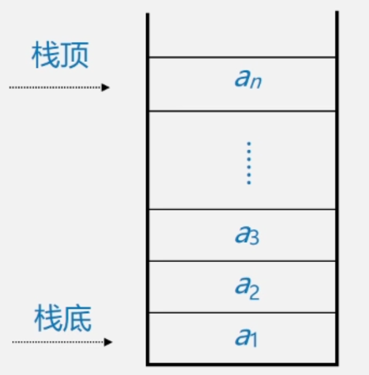
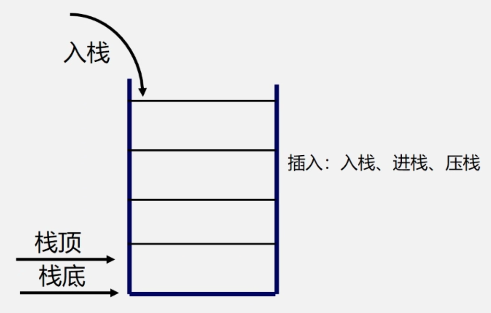
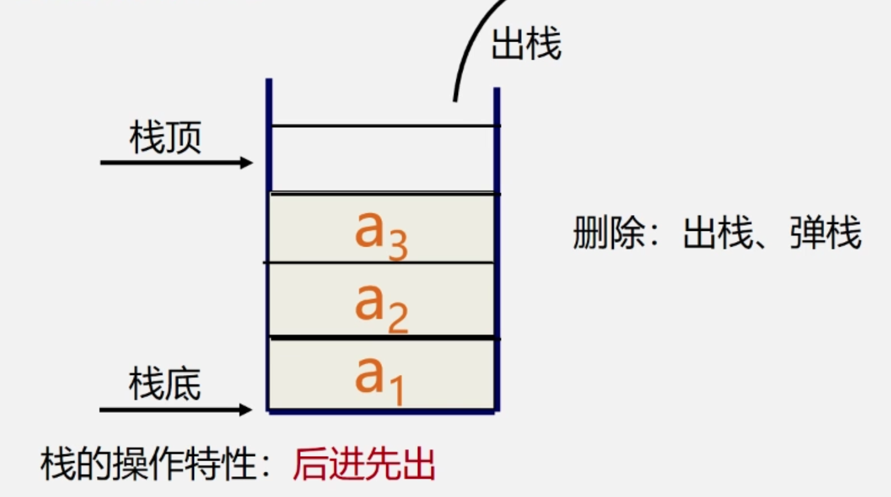
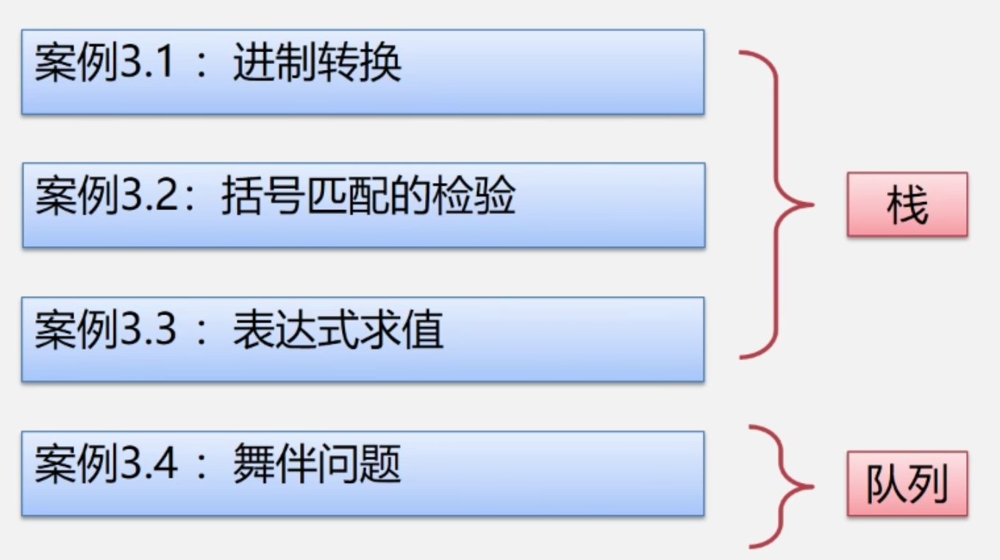

# 3.1 栈和队列的定义和特点

- 栈和队列是两种常用的、重要的数据结构
- 栈和队列是限定插入和删除只能在表的“端点”进行的线性表
  - **栈和队列是线性表的子集（只是插入和删除位置受限的线性表）**

**线性表**插入和删除的位置

Insert(L, i, x) 其中$1<= i <= n+1$

Delete(L, i) 其中 $1 <= i <= n$

**栈**插入和删除的位置

Insert(S, n+ 1, x)

Delete(S, n)

**队列**插入和删除的位置

Insert(Q, n+1, x)

Delete(Q, 1)

##### 栈的应用

- 由于栈的操作具有后进先出的固有特性，使得栈成为程序设计中的有用工具。另外，如果问题求解的过程具有“**后进先出**”的天然特性的话，则求解的算法中也必然需要利用"栈"。

  - 数制转换
  - 括号匹配的检验
  - 行编辑程序
  - 迷宫求解

  - 表达式求值

  - 八皇后问题

  - 函数调用

  - 递归调用的实现

##### 队列的应用

- 由乎队列的操作具有**先进先出**的特性，使得队列成为程序设计中解决类似排队问题的有用工具。
  - 脱机打印输出：按申请的先后顺序依次输出。
  - 多用户系统中，多个用户排成队，分时地循环使用CPU和主存
  - 按用户的优先级排成多个队，每个优先级一个队列
  - 实时控制系统中，信号按接收的先后顺序依次处理
  - 网络电文传输，按到达的时间先后顺序依次进行

## 3.1.1 栈的定义和特点

- 定义：栈（Stack）是一个特殊的线性表，是限定仅在一端（通常是表尾）进行插入和删除操作的线性表。
- 特点：又称为后进先出 （Last In First Out）的线性表，简称LIFO结构。

**栈的相关概念**

1. 栈 是仅在表尾进行插入、删除操作的线性表。
2. 表尾（即$a_n$端）称为栈顶 Top；表头（即$a_1$端）称为栈底Base

- 例如：栈 $S=(a_1, a_2， a_3,..., a_{n-1}, a_n)$ ，$a_1$称为栈底元素，$a_n$称为栈顶元素

3. 插入元素到栈页（即表尾）的操作，称为入栈；从栈顶（即表尾）删除最后一个元素的操作，称为出栈。

| 栈的示意图                                                   | 入栈示意图                                                   | 出栈示意图                                                   |
| ------------------------------------------------------------ | ------------------------------------------------------------ | ------------------------------------------------------------ |
|  |  |  |

4. 逻辑结构：与同线性表相同，仍为一对一关系。
5. 存储结构：用顺序栈或链栈存储均可，但以顺序栈更常见
6. 运算规则：只能在栈顶运算，且访问结点时依照进先出（LIFO）的原则。
7. 实现方式：关键是编写入栈和出栈函数，具体实现依顺序栈或链栈的不同而不同。

**栈与一般线性表的异同**

| 一般线性表             | 栈                     |
| ---------------------- | ---------------------- |
| 逻辑结构：一对一       | 逻辑结构：一对一       |
| 存储结构：顺序表，链表 | 存储结构：顺序栈，链栈 |
| 运算规则：随机存取     | 运算规则：后进先出     |

## 3.1.2 队列的定义和特点

- 队列（queue）是一种先进先出（Frist In Frist Out ----FIFO）的线性表。在表一端插入（表尾），在另一端（表头）删除
  - $Q = (a_1, a_2,...,a_n)$

**队列的相关概念**

1.定义：只能在表的一端进行插入运算，在表的另一端进行删除运算的线性表（头删尾插）

2.逻辑结构：与同线性表相同，仍为一对一关系。

3.存储结构：顺序队或链队，以循环顺序队列更常见。

4.运算规则：只能在队首和队尾运算，且访问结点时依照先进先出（FIFO）的原则。

5.实现方式：关键是掌握入队和出队操作，具体实现依顺序队或链队的不同而不同。

# 3.2 案例引入



# 3.3 栈的表示和操作的实现

## 3.3.1 栈的抽象数据类型的类型定义

栈的抽象数据类型的定义：


**栈的基本操作**

| 函数名           | 操作            | 初始条件         | 操作结果                            |
| :--------------- | --------------- | ---------------- | ----------------------------------- |
| InitStack(&S)    | 初始化          | ——               | 构造一个空栈 S                      |
| DestroyStack(&S) | 销毁栈操作      | 栈S已存在        | 栈S被销毁                           |
| StackEmpty(S)    | 判定S是否为空栈 | 栈S已存在        | 若栈S为空栈，则返回TRUE，否则 FALSE |
| StackLength(S)   | 求栈的长度      | 栈S已存在        | 返回S的元素个数，即栈的长度         |
| GetTop(S, &e)    | 取栈顶元素      | 栈S已存在且非空  | 用e返回S的栈顶元素                  |
| ClearStack(&S)   | 栈置空操作      | 栈S已存在        | 将S清为空栈                         |
| Push(&S, e)      | 入栈操作        | 栈S已存在        | 插入元素e 为新的栈顶元素            |
| Pop(&S, &e)      | 出栈操作        | 栈S 已存在且非空 | 删除S的栈顶元素$a_n$，并用e返回其值 |

**栈的表示和实现**

- 栈的顺序存储：顺序栈
- 栈的链式存储：链栈

- **空栈标志：base == top**
- **栈满标志：top-base == stacksize**

## 3.2.2 顺序栈的表示和实现

顺序栈的表示：

```c++
#define MAXSIZE 100
typedef struct
{
  SElemType *base;
  SElemType *top;
  int stacksize;
}SqStack;
```

顺序栈的初始化：

```c++
Status InitStack(Sqstack &S)
{
  S.base = new SElemType[MAXSIZE];
  if(!S.base) exit (OVERFLOW);
  S.top = S.base;
  S.stacksize = MAXSIZE;
  return OK;
}
```

